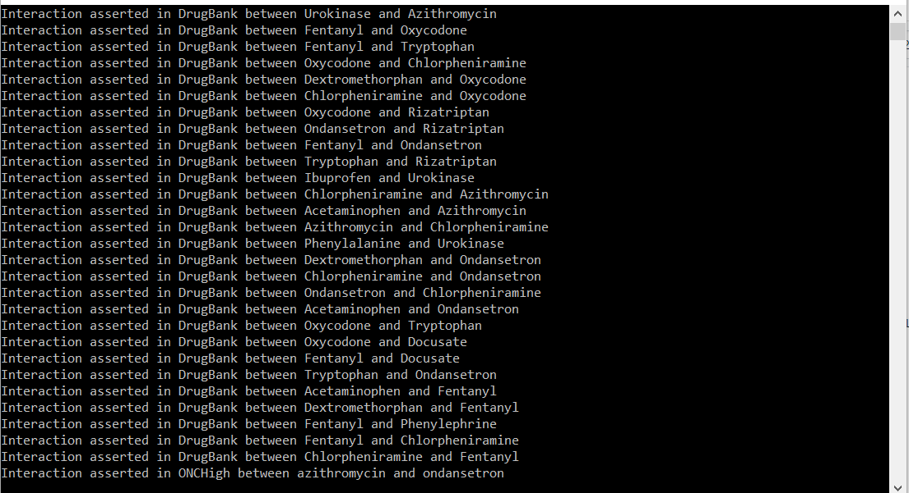

# DrugInteractionAPI

Allows user to work with POCOs of drug-drug interactions returned from the NLM's Drug Interaction.

## Usage

```CSharp

class Program
    {
        static async Task Main(string[] args)
        {
            var client = new InteractionClient();
            var rxcuisExample = new List<string> {"310964","1113397","1247756","313992","104895","330765","608930","141962","1161682","800405"};
            var interactions = await client.GetInteractionListAsync(rxcuisExample);

         
                interactions.ForEach(i=>i.DrugInteractionDetails
                            .Select(a => a.InteractionAssertion)
                            .ToList()
                            .ForEach(d=> Console.WriteLine(d)));

            Console.ReadLine();
        }
    }

```


